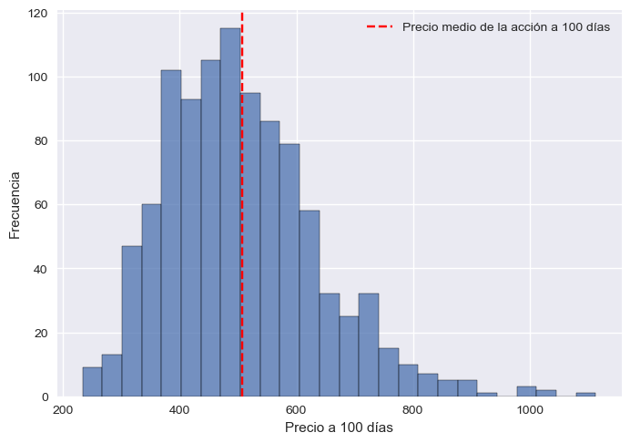

# MonteCarloStockPrediction

MonteCarloStockPrediction is a Python-based project that utilizes Monte Carlo simulations to forecast future stock prices. This approach models the uncertainty and volatility in financial markets, providing valuable insights for financial analysis and risk management.

## Overview

The core of this project involves simulating multiple possible future paths for stock prices using historical data. This is achieved through the application of Monte Carlo simulations, which are based on the following key concepts:

### Geometric Brownian Motion (GBM)

The model used for simulation is the Geometric Brownian Motion, which assumes that stock prices follow a stochastic process. The formula for updating the stock price in the model is:

})

where:
-  is the price at time t.
-  is the price at the previous time step.
-  is the expected return (drift) of the stock.
-  is the volatility (standard deviation) of returns.
-  is a standard normal random variable (with mean 0 and variance 1).

### Simulation Process

1. **Estimate Parameters**: Compute the mean  and standard deviation ) of the historical logarithmic returns.
2. **Generate Simulations**: Use the Geometric Brownian Motion formula to simulate multiple future paths of stock prices over a specified period.
3. **Analyze Results**: Evaluate the simulated paths to gain insights into potential future price movements, risk, and volatility.

The simulation results are visualized through plots of the generated price paths, allowing for a comprehensive analysis of potential future scenarios.

## Features

- **Monte Carlo Simulations**: Generate multiple future stock price scenarios.
- **Parameter Estimation**: Calculate mean and standard deviation of historical returns.
- **Visualization**: Plot simulated price trajectories for analysis.
- **Customization**: Adjust parameters to fit different stocks and time periods.

## Some Results

All price trajectories generated by the MonteCarlo simulations are shown here.

At 100 days, this is the histogram of prices for all simulations, where the average share price is marked in red.

## Future Ideas

The next steps would be interesting to be related into ARIMA's models and AI aproaches. Working on it!
